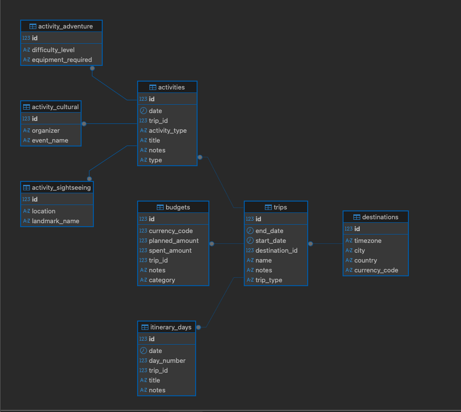

# TRIPapi

TRIP stands for **Travel Routes & Itinerary Planner**.  
A RESTful API built with **Spring Boot** and **MySQL**, providing endpoints to manage trips, destinations, budgets, activities, and itinerary days.

---

## 🚀 Features
- Manage **Destinations** with country, city, currency, and timezone.
- Organize **Trips** linked to destinations.
- Plan **Activities** with different subtypes:
    - Sightseeing
    - Adventure
    - Cultural
- Track **Budgets** with categories and planned vs. spent amounts.
- Create detailed **Itinerary Days** for each trip.
- Full CRUD operations for all entities.
- Integrated with **Swagger UI** for API exploration.
- In-memory **H2 database** for testing.

---

## 🛠️ Tech Stack
- **Java 17**
- **Spring Boot 3** (Web, Data JPA, Validation)
- **Hibernate**
- **MySQL** (main DB)
- **H2 Database** (test profile)
- **JUnit 5** + **Mockito** for testing
- **Swagger/OpenAPI**
- **ChatGPT**

---

## 📦 Project Structure

```text
TRIPapi/
├─ pom.xml
├─ README.md
├─ src
│  ├─ main
│  │  ├─ java/com/tripapi
│  │  │  ├─ TriPapiApplication.java
│  │  │  ├─ config
│  │  │  │  ├─ DataInitializer.java          # Seeds sample data
│  │  │  │  └─ OpenAPIConfig.java            # Swagger/OpenAPI config
│  │  │  ├─ controller                       # REST controllers
│  │  │  │  ├─ ActivityController.java
│  │  │  │  ├─ BudgetController.java
│  │  │  │  ├─ DestinationController.java
│  │  │  │  ├─ ItineraryDayController.java
│  │  │  │  └─ TripController.java
│  │  │  ├─ dto                              # Request/Response DTOs
│  │  │  │  ├─ Activity/
│  │  │  │  ├─ Budget/
│  │  │  │  ├─ Destination/
│  │  │  │  ├─ ItineraryDay/
│  │  │  │  └─ Trip/
│  │  │  ├─ enums                            # CurrencyCode, ActivityType, etc.
│  │  │  ├─ model                            # JPA entities (+ Activity subclasses)
│  │  │  ├─ repository                       # Spring Data JPA repositories
│  │  │  └─ service
│  │  │     ├─ impl                          # Service implementations
│  │  │     └─ interfaces                    # Service interfaces
│  │  └─ resources
│  │     ├─ application.properties           # MySQL config
│  │     └─ schema.sql / data.sql (optional)
│  └─ test
│     ├─ java/com/tripapi
│     │  ├─ TriPapiApplicationTests.java     # Context load smoke test
│     │  ├─ controllerTest/                  # MockMvc controller tests
│     │  │  ├─ ActivityControllerTest.java
│     │  │  ├─ BudgetControllerTest.java
│     │  │  ├─ DestinationControllerTest.java
│     │  │  ├─ ItineraryDayControllerTest.java
│     │  │  └─ TripControllerTest.java
│     │  └─ service/impl/                    # Mockito unit tests
│     │     └─ ActivityServiceImplTest.java
│     └─ resources
│        └─ application-test.properties      # H2/in-memory test profile

---

## ▶️ How to Run Locally

1. Clone the repository:
   ```bash
   git clone https://github.com/Salva985/TRIPapi.git
   cd TRIPapi

---

## ▶️ Run with Maven

```bash
    mvn spring-boot:run
```

---

## 🦾 Access the API

```
  Swagger UI → http://localhost:8080/swagger-ui.html
  H2 Console (test mode) → http://localhost:8080/h2-console
```

---

## 📊 Database Schema

Here’s the ER diagram generated from DBeaver:



---

## 🎭 Activity & Subclasses

One of the core features of TRIPapi is the **`Activity` entity hierarchy**.  
Instead of a flat design, we used **inheritance** to model different activity types:

- **SightseeingActivity** → `landmarkName`, `location`
- **AdventureActivity** → `difficultyLevel`, `equipmentRequired`
- **CulturalActivity** → `eventName`, `organizer`

All share the common base fields:
- `tripId`, `date`, `title`, `notes`, `type`

This allows:
- Cleaner DTOs and database design
- Enum-based validation (`ActivityType`)
- More realistic travel planning (e.g. Opera Night vs. Kayak Adventure vs. Park Tour)

---

## 🔑 API Endpoints Overview

### Destinations
- POST /api/destinations → create new destination
- GET /api/destinations → list all
- GET /api/destinations/{id} → get by id
- PUT /api/destinations/{id} → update
- DELETE /api/destinations/{id} → delete

### Trips
- POST /api/trips
- GET /api/trips
- GET /api/trips/{id}
- PUT /api/trips/{id}
- DELETE /api/trips/{id}

### Activities
- POST /api/activities
- GET /api/activities
- GET /api/activities/{id}
- PUT /api/activities/{id}
- DELETE /api/activities/{id}

### Budgets
- POST /api/budgets
- GET /api/budgets
- GET /api/budgets/{id}
- PUT /api/budgets/{id}
- DELETE /api/budgets/{id}

### Itinerary Days
- POST /api/itinerary-days
- GET /api/itinerary-days
- GET /api/itinerary-days/{id}
- PUT /api/itinerary-days/{id}
- DELETE /api/itinerary-days/{id}

---

## 📌 Example JSON Payloads

### Create Destination
{
"city": "Barcelona",
"country": "Spain",
"currencyCode": "EUR",
"timezone": "Europe/Madrid"
}

### Create Trip
{
"name": "Summer Escape",
"startDate": "2025-07-01",
"endDate": "2025-07-10",
"destinationId": 1
}

### Create Activity (Adventure)
{
"tripId": 1,
"date": "2025-07-06",
"title": "Kayak in Costa Brava",
"notes": "Bring sunscreen",
"type": "ADVENTURE",
"difficultyLevel": "LOW",
"equipmentRequired": "Life vest"
}

### Create Budget
{
"tripId": 1,
"plannedAmount": 500.00,
"spentAmount": 120.00,
"currencyCode": "EUR",
"category": "FOOD",
"notes": "Restaurants and snacks"
}

---

## 🧪 Running Tests

```
mvn -q -Dspring.profiles.active=test test
```
✔️ Includes unit tests with Mockito and integration-style controller tests with MockMvc.

---

## 📚 Extras

- Swagger UI enabled for easy exploration.
- Database configured in application-test.properties for clean isolated tests.
- DataInitializer seeds example data (Trips, Activities, Budgets).

---

## 👨‍💻 Author

Developed by Salva (Ironhack - Java Development, Bootcamp Mod.2).